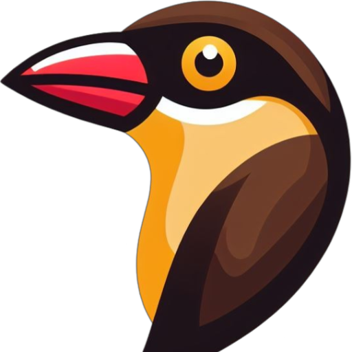

<p align="center">
  
</p>

<h1 align="center">HTML to Oxpecker</h1>

This is the source code of the [HTML to Oxpecker](https://GoswinR.github.io/html-to-oxpecker) website — a browser tool that converts HTML to F# [Oxpecker.Solid](https://github.com/Lanayx/Oxpecker) markup and SolidJS JSX.

> **This is a port of [solidjs-community/html-to-solidjsx](https://github.com/solidjs-community/html-to-solidjsx), adapted for [Oxpecker](https://github.com/Lanayx/Oxpecker).**
> It keeps the original HTML → SolidJS JSX converter and adds a third pane that converts the same HTML into F# Oxpecker.Solid markup. All credit for the original tool goes to the SolidJS community.

## Purpose

Existing HTML to JSX online transformers aren't compatible for SolidJS, it transforms to JSX that is suited for React templates.

1. Replaces standard HTML attributes such as `class` and `for` to `className` and `htmlFor`.
2. Incorrectly changes css variables names inside style attribute.

Solid attempts to stay as close to HTML standards as possible, allowing copy and paste from answers on Stack Overflow or from template builders from your designers. This [site](https://GoswinR.github.io/html-to-oxpecker) brings that goal even closer by converting void elements(`<br>`) to self-closing(`<br/>`), while also providing customizations such as the option to camelCase attributes or having style attribute value set as a CSS object or string.

## F# Oxpecker output

Alongside the JSX output, a third editor pane converts the same HTML into F#
[Oxpecker.Solid](https://lanayx.github.io/Oxpecker/src/Oxpecker.Solid/) markup —
e.g. `h1(class'="heading") { "Hello" }`. The converter mirrors Oxpecker's typed
DSL: string attributes become idiomatic named arguments, `int`/`bool` attributes
are emitted with the right type (`tabindex=2`, `disabled=true`), SVG element and
attribute names are matched (including reserved-word cases like the `<use>`
element → `use'`), and anything Oxpecker doesn't model as a property falls back
to the `.attr(...)` / `.bool(...)` extension methods.

Generated SVG markup requires `open Oxpecker.Solid.Svg`.

## Development

```sh
pnpm install
pnpm dev      # start the dev server
pnpm build    # static build to dist/public
pnpm test     # compile-test the F# Oxpecker output (see below)
```

### Tests

`pnpm test` (alias `pnpm test:fsharp`) verifies that the generated F# actually
compiles against the real `Oxpecker.Solid` NuGet package: it runs the converter
over [`test/fsharp/fixtures/*.html`](test/fsharp/fixtures) and compiles the
result with [Fable](https://fable.io/). It requires the
[.NET SDK](https://dotnet.microsoft.com/) on your `PATH`. See
[`test/fsharp/README.md`](test/fsharp/README.md) for details.

## Credits / Technologies used

- [solid-start](https://start.solidjs.com/): The meta-framework
- [solid-js](https://github.com/solidjs/solid/): The view library
- [codemirror](https://codemirror.net/): The in-browser code editor
- [solid-codemirror](https://github.com/riccardoperra/solid-codemirror): The SolidJS bindings for codemirror
- [htmltojsx](https://github.com/reactjs/react-magic/blob/master/README-htmltojsx.md)(modified for Solid JSX compatiblity): The HTML to JSX converter
- [Oxpecker.Solid](https://github.com/Lanayx/Oxpecker): The target F# DSL for the Oxpecker output (compile-tested with [Fable](https://fable.io/))
- [UnoCSS](https://uno.antfu.me/): The CSS framework
- [solid-primitives](https://github.com/solidjs-community/solid-primitives): The utilities/primitives
- [vite](https://vitejs.dev/): The module bundler
- [pnpm](https://pnpm.js.org/): The package manager
